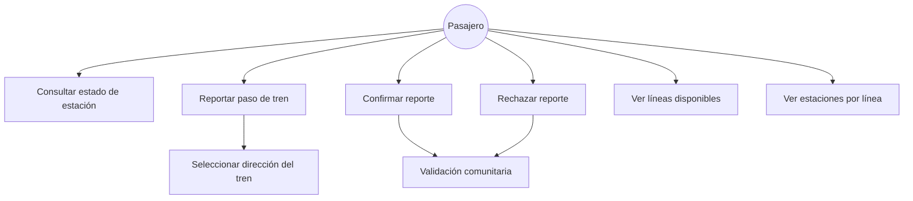
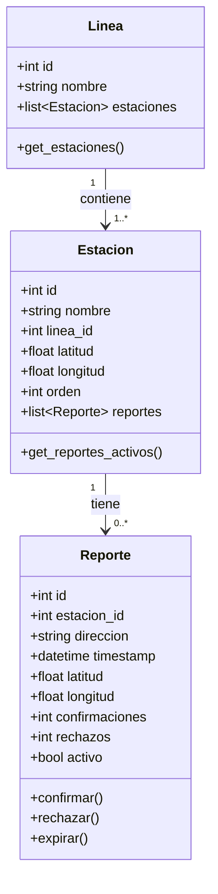
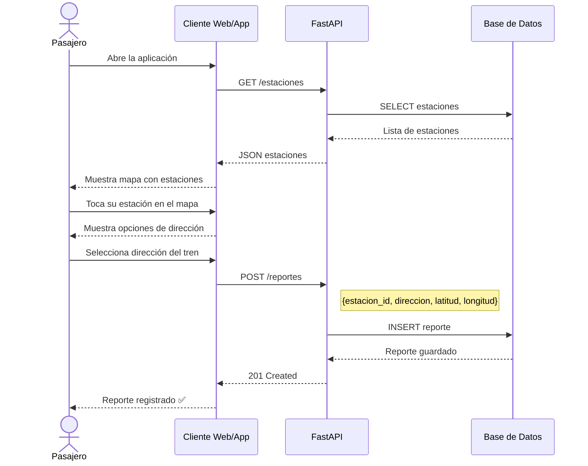
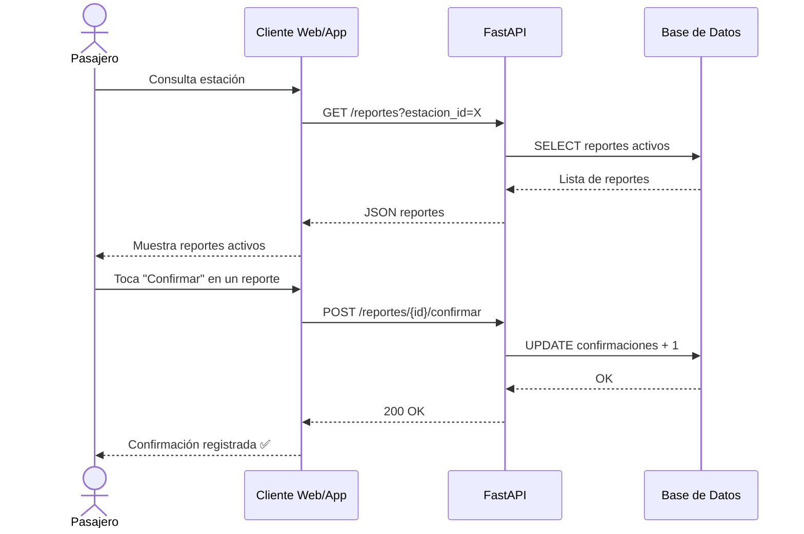
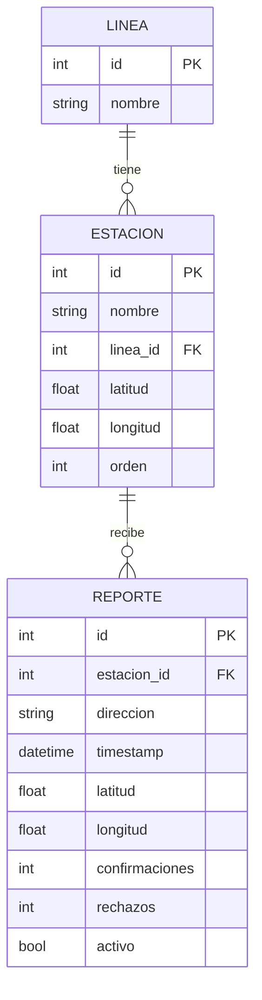
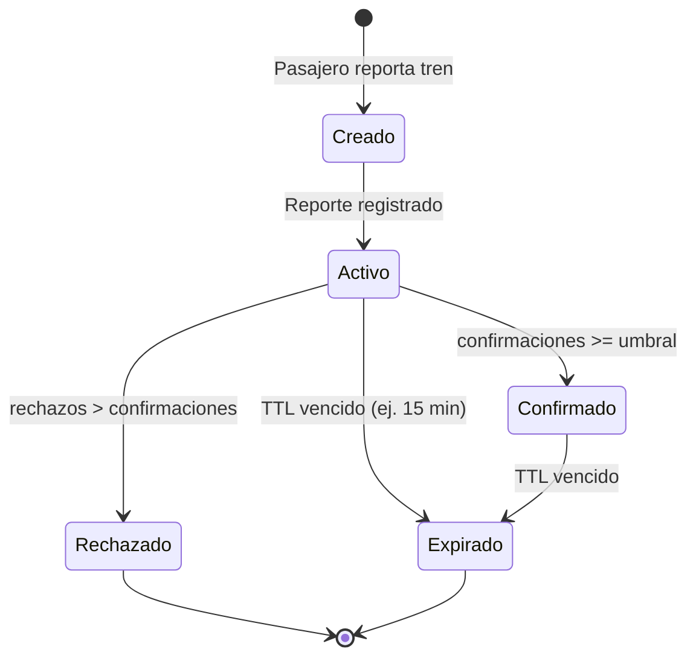

# 📐 Diagramas UML — Movilidad México

> Diagramas de diseño del sistema usando notación Mermaid.  
> Versión: 1.0 | Fecha: Junio 2026

---

## 1. 🧑‍💻 Diagrama de Casos de Uso



**Descripción:**
- El único actor en esta fase es el **Pasajero**.
- El sistema no tiene administradores en v1.0.
- La validación comunitaria se activa con confirmaciones y rechazos.

---

## 2. 🏛️ Diagrama de Clases



---

## 3. 🔄 Diagrama de Secuencia — Reportar paso de tren



---

## 4. 🔄 Diagrama de Secuencia — Confirmar reporte



---

## 5. 🗄️ Diagrama Entidad-Relación



---

## 6. 🧩 Diagrama de Componentes

```mermaid
graph TB
    subgraph Cliente
        WEB[Cliente Web / App]
    end

    subgraph Backend
        API[FastAPI]
        subgraph Routers
            R1[/lineas]
            R2[/estaciones]
            R3[/reportes]
        end
    end

    subgraph Base de Datos
        DEV[(SQLite\nDesarrollo)]
        PROD[(PostgreSQL\nProducción)]
    end

    WEB -->|HTTP REST| API
    API --> R1
    API --> R2
    API --> R3
    R1 --> DEV
    R2 --> DEV
    R3 --> DEV
    DEV -.->|migración futura| PROD
```

---

## 7. 🔁 Diagrama de Actividad — Ciclo de vida de un reporte



---

> 📋 Ver análisis completo del sistema en [docs/analisis.md](./analisis.md)

---

*Diagramas elaborados por el equipo de Movilidad México — Junio 2026*
